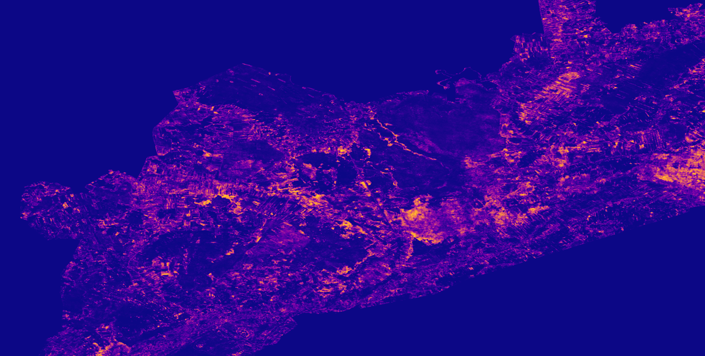

<p align="center">
  
  <br>
  <sub><em>Zoomed view of predicted shrub encroachment probability in Biebrza National Park (Conv1D model, Landsat biannual composites).</em></sub>
</p>

<p align="center">
  <a href="https://biebrza-shrub-encroachment-analysis.streamlit.app/" target="_blank">
    
  </a>
</p>


# 🌿 Biebrza Shrub Encroachment – Landsat Time Series & Deep Learning

This repository contains the full workflow, data, model, and [interactive app](https://biebrza-shrub-encroachment-analysis.streamlit.app/) for analyzing **shrub vegetation encroachment** in **Biebrza National Park (Poland)** using **biannual Landsat composites (1997–2015)** and a **1D convolutional neural network** trained on per-pixel spectral time series.

The project integrates:
- **Google Earth Engine** (data preparation & sampling)
- **PyTorch** (model training)
- **Streamlit** (interactive visualization)
- **rasterio / numpy / pandas** (data manipulation)
- Ecological context from **Kopeć & Sławik (2020)**, who provide MPC vegetation estimates for the lower Biebrza basin.

---

## 📖 Background

Biebrza National Park protects one of Europe’s largest peatland ecosystems, dominated by wet meadows, sedge marshes, and floodplain wetlands. Due to land abandonment and loss of traditional mowing, the area has experienced **rapid shrub encroachment**, impacting biodiversity, hydrology, and landscape.

The **Mean Percentage Coverage (MPC)** estimates for years 1997 and 2015 by Kopeć & Sławik (2020) provide a measure of shrub/tree cover on a **125 × 125 m** grid for the lower Biebrza basin. These MPC trajectories form the weak-supervision basis for this project.

**APA citation:**  
Kopeć, D., & Sławik, Ł. (2020). *How to effectively use long-term remotely sensed data to analyze the process of tree and shrub encroachment into open protected wetlands.* Journal of Environmental Management, 268, 110669.

---

## 🧠 Goal of the Project

To classify **30 m Landsat pixels** into five long-term vegetation trajectory classes:

- `wetland_to_woody`
- `shrubs_to_trees`
- `stable_wetland`
- `stable_trees`
- `stable_shrubs`

…using **biannual spectral/index time series** (NDMI, NBR, NDVI, NIR, SWIR1, SWIR2).

The final result is a **per-pixel encroachment prediction map** stored as a GeoTIFF mosaic.

---

## 🔄 Full Workflow

### **1. GEE Data Preparation**
Notebook: **`gee_data_preparation.ipynb`**

- Load Landsat 5/7/8 SR collections  
- Compute biannual composites (cloud-free)  
- Add NDMI/NBR/NDVI/NIR/SWIR1/SWIR2  
- Sample ~2M pixel time series using MPC labels  
- Export as CSV

---

### **2. Model Training**
Notebook: **`ml_model_training.ipynb`**

Key steps:
- Stratified split by MPC square (`numark`)
- Normalize features per band × year
- Train **Conv1D** and **LSTM** models with class weighting
- Remove ambiguous training samples for better generalization

**Final accuracy:**
- **Conv1D:** 0.741  
- **LSTM:** 0.755  

Conv1D selected as the **final model** because it performs better on the ecologically most important class (`wetland_to_woody`).

Model weights stored in:
```
final_model/conv1d_best_model.pth
```

---

### **3. Inference & Mosaic Generation**
Notebook: **`biebrza_streaming_1997_2015_inference.ipynb`**

- Load final Conv1D model  
- Run inference on the entire Biebrza area in **252×252 px tiles**  
- Save mosaics:
  - `dominant_class`
  - `probability_wetland_to_woody`
  - `uncertainty`

Output files:
```
data/mosaic_1997_2015.tif
data/mosaic_1997_2015_biebrza_web.tif
```

---

### **4. Representative Examples & Class Trajectories**
Notebook: **`notebooks/select_representative_series.ipynb`**

Produces:
- `class_trajectories.csv`  
- `representative_examples.csv`  

These feed the Streamlit visualization.

---

## 🌐 Streamlit App (`app.py`)

Features:
### **🗺 Map Tab**
- View model predictions over Biebrza:
  - dominant class  
  - probability of encroachment  
  - uncertainty  

### **🔍 Representative Pixels Tab**
- Explore:
  - correctly classified examples  
  - typical misclassifications  
  - false positives  

### **📈 Class Trajectories Tab**
- Mean ± std time series for each class  
- Helps interpret what the model learned  

---

## 🚀 Running the App

Install dependencies:

```bash
pip install -r requirements.txt
```

Launch:

```bash
streamlit run app.py
```

Ensure that the **data/** folder and **final_model/** weights exist.

---

## 📌 Future Work

- Add 2005–2023 Sentinel-driven predictions  
- Compute ∆ probability maps  

---

## 📝 Citation

If you use this repository, please cite:

Kopeć, D., & Sławik, Ł. (2020). How to effectively use long-term remotely sensed data to analyze the process of tree and shrub encroachment into open protected wetlands. Applied Geography, 125, 102345. https://doi.org/10.1016/j.apgeog.2020.102345
